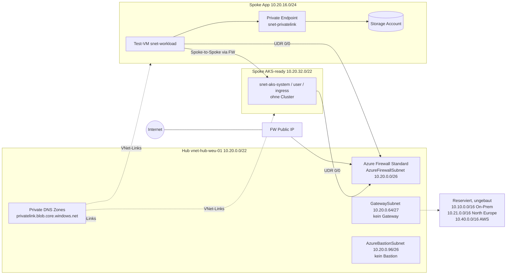

# az-hubspoke-weu

Landing-Zone-Connectivity als Portfolio-Repo: ein Hub, zwei Spokes, Azure Firewall als Default-Route, Private DNS, ein Private Endpoint.  
Region `westeurope`. Terraform. Strikt ephemeral. **Apply-fähig** (`env/weu-lab`).

Kein vWAN, kein Live-AKS, kein VPN-Gateway.

## 1. Problem

Typischer Ausgangspunkt in DACH-Projekten:

- Spokes peeren wild untereinander (Inspection umgangen, Peering ist nicht transitiv — bis jemand es transitiv *macht*)
- Workload-VMs mit Public IP statt zentralem Egress
- Private Endpoints ohne Private DNS; Namen lösen öffentlich auf
- CIDR aus `10.0.0.0/8` „erstmal“, On-Prem später überlappend

Dieses Repo zeigt den Gegenentwurf in einer Region, destroy-bar.

## 2. Entscheidung

| Frage | Wahl | Warum nicht das Andere |
|---|---|---|
| Topologie | Hub-Spoke, VNet-Peering | vWAN: teurer, undurchsichtiger im Lab, ADR-0001 |
| Inspection | Azure Firewall Standard | NSG-only reicht nicht; Premium/DDoS/NVA siehe ADR-0002 |
| IaC | Terraform | Markt + spätere AWS-Nähe, ADR-0003 |
| PaaS | PE im Spoke, Zonen im Hub | ADR-0004 |
| Hybrid | `GatewaySubnet` leer | kein 45-Minuten-Gateway im Lab, ADR-0005 |
| Kubernetes | Subnet-Layout | Cluster überdeckt das Netz, ADR-0006 |

Details: [`DECISIONS.md`](DECISIONS.md).

## 3. Diagramm



Peering nur Spoke ↔ Hub. Spoke ↔ Spoke gibt es nicht.

## 4. CIDR

Kurzform. Voll: [`docs/cidr.md`](docs/cidr.md).

| VNet / Block | CIDR | Deploy |
|---|---|---|
| Hub | `10.20.0.0/22` | ja |
| Spoke App | `10.20.16.0/24` | ja |
| Spoke AKS-ready | `10.20.32.0/22` | ja, ohne Cluster |
| Spoke Data | `10.20.48.0/24` | nein |
| Pair `northeurope` | `10.21.0.0/16` | nein |
| On-Prem | `10.10.0.0/16` | nein |
| AWS | `10.40.0.0/16` | nein |

Hub-Subnets: `AzureFirewallSubnet /26`, `GatewaySubnet /27`, `AzureBastionSubnet /26` (Ressource aus), `snet-shared /24`.

## 5. Traffic-Pfade

1. Spoke → Internet: UDR `0.0.0.0/0` → Firewall SNAT, nicht Spoke-NAT.
2. Spoke A → Spoke B: über Firewall, nicht über Peering.
3. Spoke → Storage: Private Endpoint im Spoke, Name über zentrale Private-DNS-Zone.
4. On-Prem → Spoke: nur dokumentiert. Keine UDR auf `GatewaySubnet`.
5. Management: keine Public IP auf der Test-VM. Zugriff per `run-command` / Serial Console.

Failure-Modes und Routen-Tabelle: [`docs/traffic-paths.md`](docs/traffic-paths.md).

## 6. Module / Ordner

```
az-hubspoke-weu/
├── README.md
├── DECISIONS.md
├── docs/
│   ├── cidr.md
│   └── traffic-paths.md
├── modules/
│   ├── hub/         # VNet, Subnets, Peerings-Daten
│   ├── spoke/       # VNet, Subnets, UDR 0/0
│   ├── firewall/    # FW Standard, Policy, PIP
│   └── dns/         # Private DNS Zones + VNet-Links
├── env/weu-lab/     # Komposition der Module
└── scripts/
    └── destroy.sh
```

Namenskonvention:

| Typ | Muster | Beispiel |
|---|---|---|
| RG Connectivity | `rg-conn-hub-<region>-01` | `rg-conn-hub-weu-01` |
| RG Spoke | `rg-spoke-<role>-<region>-01` | `rg-spoke-app-weu-01` |
| VNet | `vnet-<role>-<region>-01` | `vnet-hub-weu-01` |
| Subnet (frei wählbar) | `snet-<role>` | `snet-workload` |
| Subnet (Microsoft-Pflicht) | fester Name | `AzureFirewallSubnet` |

Tags an jeder RG/Ressource: `project=az-hubspoke-weu`, `env=lab`, `destroy=ephemeral`.

## 7. Deploy

Voraussetzungen: Azure CLI angemeldet, **Contributor** auf einer Wegwerf-Subscription, Terraform >= 1.9.

```bash
az login
az account set --subscription "<wegwerf-sub>"
export ARM_SUBSCRIPTION_ID="$(az account show --query id -o tsv)"

cd env/weu-lab
terraform init
terraform plan -out=tfplan
terraform apply tfplan
```

`terraform.tfvars` ist optional (Defaults reichen). State bleibt lokal und ist gitignored. Remote-Backend: `backend.tf.example` kopieren, nicht committen.

Apply dauert vor allem wegen der Firewall mehrere Minuten. Danach sofort das Testdrehbuch, danach Destroy — die Firewall läuft auf der Uhr.

## 8. Testdrehbuch

Outputs:

```bash
terraform output firewall_private_ip
terraform output storage_blob_fqdn
terraform output probe_vm_name
```

**Routen** (Next-Hop muss die Firewall-IP sein, nicht Internet und nicht Peering Richtung 10.20.32.0/22):

```bash
az network nic show-effective-route-table \
  --ids "$(az network nic list -g rg-spoke-app-weu-01 --query "[0].id" -o tsv)" \
  -o table
```

**Egress über Firewall** (keine Public IP auf der VM):

```bash
az vm run-command invoke \
  -g rg-spoke-app-weu-01 -n vm-probe-app-weu-01 \
  --command-id RunShellScript \
  --scripts "curl -sI https://example.com | head -n 5"
```

Erwartung: HTTP/2 200. Ohne UDR würde der Traffic die Firewall nicht sehen.

**Private DNS / PE:**

```bash
SA="$(terraform output -raw storage_blob_fqdn)"
az vm run-command invoke \
  -g rg-spoke-app-weu-01 -n vm-probe-app-weu-01 \
  --command-id RunShellScript \
  --scripts "getent hosts ${SA} || nslookup ${SA}"
```

Erwartung: Adresse in `10.20.16.64/27`, nicht die öffentliche Storage-VIP.

**Spoke-to-Spoke nicht transitiv:** es gibt kein Peering App ↔ AKS. Effektive Route für `10.20.32.0/22` auf der App-NIC: VirtualAppliance = Firewall-IP.

Danach in derselben Session:

```bash
cd ../..
./scripts/destroy.sh
```

## 9. Kosten und Destroy

Grobe Ordnung, Pay-as-you-go, Stand Mitte 2026, US-Listennähe (WEU ähnlich):

| Ressource | Wenn an | Wenn Destroy vergessen (Monat) |
|---|---|---|
| Azure Firewall Standard | ~1,25 USD/h + 0,016 USD/GB | ~900 USD + Traffic |
| Public IP + Mini-VMs + Storage | wenige USD/Demo | gering gegen FW |
| VPN Gateway / Bastion dedicated / AKS / DDoS | nicht im Default | — |

Zwei Stunden Demo: niedrige einstellige USD, solange Destroy läuft.

```bash
./scripts/destroy.sh
```

Skript prüft das Directory und ruft `terraform destroy` in `env/weu-lab`. Nicht „Firewall ausmachen, VNets lassen“ — alles weg.

## 10. Out-of-Scope und nächste Stufen

Nicht in diesem Wurf:

- Management Groups, ALZ-Policies, Budget-Alerts als Code
- Azure Firewall Premium, TLS-Inspection, IDPS-Feintuning
- DDoS Network Protection
- VPN- oder ExpressRoute-Gateway live
- AKS-Cluster, privater API-Server, ACR, AGIC
- Private DNS Resolver + Conditional Forwarding
- Zweite Region, vWAN, AWS-VPN
- Front Door, App Gateway, WAF als Default

Nächste Ausbaustufen, bewusst getrennt:

1. Optionales Modul `gateway` (VpnGw1, S2S gegen `vnet-onprem` in `10.10.0.0/16`)
2. Optionales Modul `aks` auf dem vorbereiteten Spoke
3. Private DNS Resolver (V6 voll), sobald On-Prem-DNS existiert
4. Diagnostic Settings + Network Watcher als festes Modul
5. GitHub Actions: plan + apply mit Approval
6. Folie „Second Door“: AWS `10.40.0.0/16` per VPN, kein Live-Bau

## Freeze

| Feld | Wert |
|---|---|
| Projekt | `az-hubspoke-weu` |
| Variante | V1 + V6-lite (DNS/PE) + V5-Layout ohne Cluster |
| IaC | Terraform |
| Region | `westeurope` |
| On-Prem | GatewaySubnet-Platzhalter |
| AKS | ready-only |
| Betrieb | apply → Demo → destroy |
